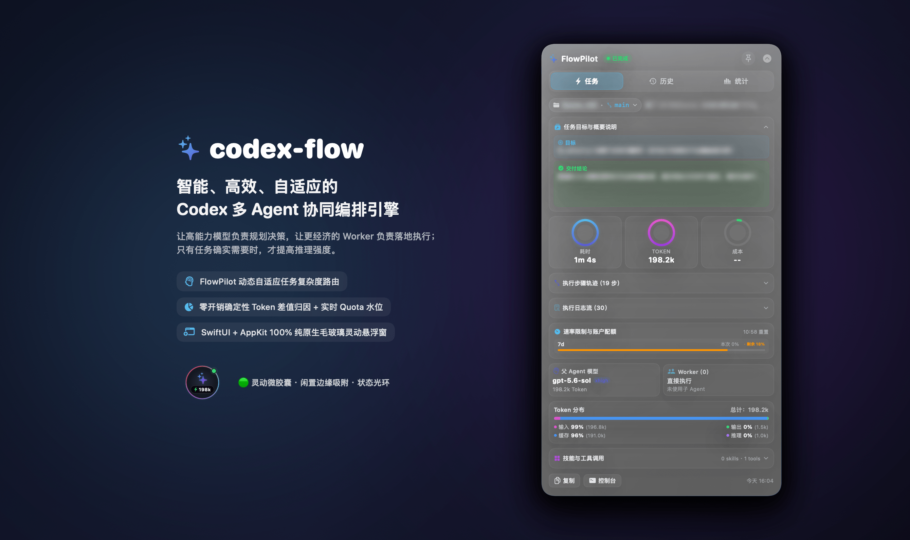
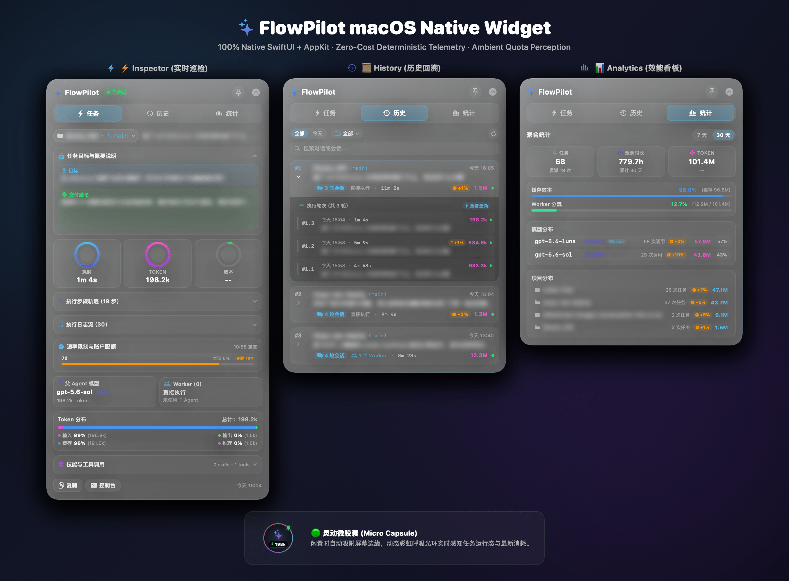

<div align="center">

<a href="https://github.com/ParsifalC/codex-flow">
  
</a>

# FlowPilot · codex-flow

**智能、高效、自适应的 Codex 多 Agent 策略编排引擎**

[](VERSION)
[](#-快速安装)
[](docs/overlay.md)
[](docs/telemetry.md)
[](https://linux.do)
[](LICENSE)

<br />



<br /><br />

[**English Documentation**](README.en.md) · [**多策略运行时**](docs/strategy-runtime.md) · [**深入配置**](docs/configuration.md) · [**遥测机制**](docs/telemetry.md) · [**原生悬浮窗**](docs/overlay.md) · [**基准评测**](docs/benchmark.md)

<br />

> 📢 **社区公测**：`codex-flow` 现已正式在 [**LINUX DO**](https://linux.do) 开启公测，欢迎各位佬友前往体验、讨论与反馈！

<br />

> **“ 让昂贵的 Parent 做高价值判断，让高性价比 Worker 用更深推理承担探索、实现、验证与调试循环；当用户明确要求最高质量时，把高级 capability 精确投放到关键 Implementer / Reviewer，而不是无差别升级所有 Worker。”**

</div>

---

## ✨ 核心亮点

<table>
  <tr>
    <td width="50%" valign="top">
      <h3>🧠 多策略运行时 (FlowPilot)</h3>
      <p>FlowPilot 从单一分发策略升级为统一 Strategy Runtime。内置 <code>efficient</code> / <code>balanced</code> / <code>quality</code> / <code>speed</code>，统一通过 TaskProfile → WorkerBudget → ExecutionPlan v7 驱动执行。</p>
    </td>
    <td width="50%" valign="top">
      <h3>⚙️ 动态 Worker Budget</h3>
      <p>Worker 数不再写死为 1~2 个。Runtime 根据不确定性、工作流隔离、Quota 与线程上限动态计算 Explorer / Implementer / Reviewer，并且可写并发始终要求真实隔离证据。</p>
    </td>
  </tr>
  <tr>
    <td width="50%" valign="top">
      <h3>🧠 Worker-first Reasoning</h3>
      <p>默认 Parent 以 <code>high</code> 为主，便宜的 Worker 以 <code>xhigh</code> 起步；委派时各 Worker role reasoning 至少比 Parent 高一档，Parent 已为 <code>max</code> 时除外。</p>
    </td>
    <td width="50%" valign="top">
      <h3>🏆 Quality Intent</h3>
      <p><code>quality</code> 支持 <code>normal / strong / absolute</code> 三档当前任务质量意图。普通 Explorer 继续优先 <code>latest-efficient</code>；强质量意图可把关键 Implementer / Reviewer 升级到 <code>latest-capable</code>。只有技术风险本身达到 critical 时，Explorer 才会升级到 Parent 级 capability。</p>
    </td>
  </tr>
</table>

---

## 🧩 四种内置策略

| Strategy | 优化目标 | 高需求任务的 Worker 倾向 |
| :--- | :--- | :--- |
| **`efficient`** | 减少昂贵 Parent 消耗与无效总成本 | 最多约 2 Explorer / 2 Implementer，低 speculation，Quota 紧张会自动收敛 |
| **`balanced`** | 平衡质量、额度与耗时 | 最多约 3 Explorer / 3 Implementer，适度安全并行 |
| **`quality`** | 最大化正确性与验证置信度 | 普通 complex 优先 Luna + `max` reasoning；`strong/absolute` 只把关键 Implementer / Reviewer 升级到 Parent 级 capability，Explorer 默认保持高性价比 |
| **`speed`** | 最小化 wall-clock latency | 最多 8 个 Implementer budget；实际数量由已证明 writable workstreams 与 Runtime ceiling 决定 |

`quality_intent` 是**当前任务语义**，不是持久化配置，也不是 `risk` 的别名；并且只有 `quality` strategy 会消费它：

```text
normal   → 普通质量目标，优先 latest-efficient Worker + 深 reasoning
strong   → 明确质量优先，允许关键 Implementer / Reviewer 使用 latest-capable
absolute → 明确最高质量优先，在安全 ceiling 内 correctness > quota / latency；Explorer 仍默认 latest-efficient
```

默认配置仍是：

```text
strategy = efficient
routing = adaptive
```

但 v1.7 的 fresh-install 资源策略已经从“Parent 与 Worker 相近 reasoning”调整为 **Parent 高价值决策 + Worker 深推理执行**。已有用户的自定义 reasoning 配置在 update/reinstall 时会无损保留。

---

## 🚀 快速安装

### 前置要求 (Prerequisites)

> 💡 **特别说明**：Codex CLI **仅用于首次安装的环境校验与一次性 Hook 授权**。初始化完成后，**日常使用完全使用 Codex 桌面端 APP 即可**，无需在终端中启动或使用 CLI。

确保环境拥有 Codex CLI（用于首次安装与授权）：
```bash
# npm 全局安装
npm install -g @openai/codex

# 或 macOS Homebrew 安装
brew install codex
```

### 一键安装

首次安装统一使用 GitHub Release 中与你的系统和 CPU 架构匹配的正式 artifact，不需要 clone 仓库。

```bash
# macOS / Linux
curl -fsSL https://raw.githubusercontent.com/ParsifalC/codex-flow/main/install-release.sh | bash
```

```powershell
# Windows PowerShell
irm https://raw.githubusercontent.com/ParsifalC/codex-flow/main/install-release.ps1 | iex
```

安装器会自动识别 OS / CPU、解析 Latest Stable Release、下载对应 artifact、校验 SHA-256、安装到 `~/.codex/codex-flow/versions/<version>`，并运行健康检查。Windows 自动选择 x86_64 / ARM64 ZIP；macOS 直接使用 Release 中已经预编译好的 FlowPilot，**安装完成后悬浮按钮会自动启动**，不会在本机执行 `build.sh`。

> ⚠️ **最后一步**：
> 1. **首次一次性授权**：在终端启动一次 `codex`，在对话框中输入 `/hooks` 批准 FlowPilot telemetry（仅需做一次，完成永久信任）。
> 2. **重启 Codex 桌面端**：完全退出 Codex 桌面应用后重新打开。FlowPilot 悬浮窗已在 macOS 桌面自动运行，后续所有日常工作**直接在 Codex 桌面端使用即可**，无需再打开终端。

---

## 🎮 基本使用

### 1. 查看 / 切换默认策略

```bash
codex-flow strategy show
codex-flow strategy profiles
codex-flow strategy set quality
codex-flow strategy set efficient
codex-flow strategy routing adaptive
```

### 2. 对话内自然语言覆盖

当前任务可以临时覆盖持久配置：

```text
👉 策略覆盖："质量优先" / "尽量少用 Plan 额度" / "尽快完成"
👉 强质量："质量优先，必要时使用更强模型" → quality_intent=strong
👉 最高质量："成本不重要，用最强模型和独立验证" → quality_intent=absolute
👉 自动路由："按默认策略实现" / "自适应处理"
👉 强制委派："delegate" / "使用子 agent 实现" / "交给 worker 处理"
👉 单兵直出："direct" / "不要使用子 agent，直接完成" / "这次直接做"
```

Strategy 与 Routing 正交，例如：

```text
quality + direct
```

表示使用 quality 的能力/推理目标，但当前任务不使用子 Agent。

### 3. 查看确定性的 ExecutionPlan

```bash
codex-flow strategy plan \
  --profile quality \
  --quality-intent strong \
  --complexity complex \
  --uncertainty high \
  --parallelism high
```

Plan 会输出 `quality_intent`、Strategy 的 `worker_budget`，以及 Runtime 实际编译出的三组角色资源：

```text
explorer_capability_policy / explorer_model / explorer_reasoning
implementer_capability_policy / implementer_model / implementer_reasoning
reviewer_capability_policy / reviewer_model / reviewer_reasoning
```

同时包含 `exploration_workers`、`implementation_workers`、`reviewer_workers` 和 `planned_worker_count`。

### 4. 交互式控制台

```bash
codex-flow
```

最新控制台同时集成了 Overlay 构建/启动入口、策略状态、Benchmark 与遥测：

```text
╭────────────────────────────────────────────────────────────────────╮
│                  🚀 codex-flow 控制台 (v2.1.0)                   │
│    FlowPilot 智能编排 · 确定性任务遥测 · 本地 Benchmark 验证     │
╰────────────────────────────────────────────────────────────────────╯
  [1] 🪟 macOS 原生悬浮窗 (overlay widget)
  [2] 📊 查看最新任务卡片 (usage last)
  [3] 📜 浏览历史任务列表 (usage list)
  [4] 📈 项目聚合统计分析 (usage stats)
  [5] 🎯 查看生效策略配置 (status)
  [6] 🩺 运行系统诊断检查 (doctor)
  [7] ⚡ 本地快速 Benchmark (benchmark-local quick)
  [8] 🔄 检查与拉取更新 (update)
  [0] 🚪 退出
```

Overlay 子菜单支持直接启动、编译并启动、仅编译，以及运行时的重编译/重启、展开切换和数据推送，不再要求用户手动先执行 `build.sh`。

### 5. 常用 CLI

```bash
codex-flow usage last
codex-flow usage list --today
codex-flow usage stats -d 30
codex-flow doctor
codex-flow update
```

---

## 🪟 FlowPilot macOS 原生悬浮窗

专为 macOS 深度定制的 **100% 纯原生毛玻璃效能看板**，打通任务生命周期与 Quota 监控。

<div align="center">
  
</div>

- **🟢 灵动微胶囊 (Capsule)**：闲置时边缘半收起，呼吸光环显示任务状态与最新消耗。
- **⚡️ 实时巡检 (Inspector)**：耗时 / Tokens / 费用、Quota 水位与 Agent 拓扑。
- **📜 历史回溯 (History)**：跨项目任务时间线与详情回溯。
- **📊 效能看板 (Analytics)**：7d/30d 缓存命中率、Worker 算力卸载比与模型/仓库分布。

```bash
codex-flow overlay start
codex-flow overlay toggle
```

---

## 📚 深入文档

| 模块 | 文档入口 | 核心内容 |
| :--- | :--- | :--- |
| **🧠 多策略运行时** | [docs/strategy-runtime.md](docs/strategy-runtime.md) | TaskProfile、Quality Intent、WorkerBudget、Strategy Registry、ExecutionPlan v7、role-scoped resources |
| **⚙️ 策略与配置** | [docs/configuration.md](docs/configuration.md) | policy schema v4、Worker-first reasoning、路由、Runtime ceiling |
| **📈 确定性遥测** | [docs/telemetry.md](docs/telemetry.md) | Hook 生命周期、Token 差值归因、账户 Quota |
| **🪟 原生悬浮窗** | [docs/overlay.md](docs/overlay.md) | 交互、IPC 与 SwiftUI 架构 |
| **🧪 本地基准测试** | [docs/benchmark.md](docs/benchmark.md) | 本地无 Key 评测与多策略对比 |
| **☁️ Actions 评测** | [docs/benchmark-actions.md](docs/benchmark-actions.md) | GitHub Actions Benchmark |
| **🌐 多语言支持** | [docs/localization.md](docs/localization.md) | 中英双语与本地化范围 |

---

## 📄 开源协议

本项目采用 [MIT License](LICENSE) 开源协议。
