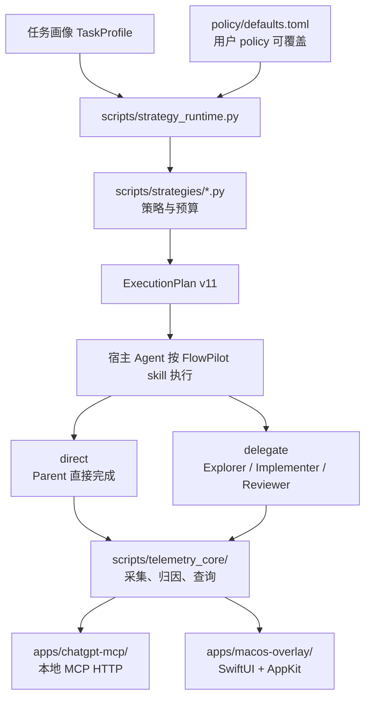

# codex-flow 开发上手指南

这份指南给准备参与开发的人使用。它把第一次阅读仓库、运行策略编译器、定位改动位置和选择验证命令串成一条短路径。建议先走完“源码运行”，再按自己负责的模块深入文档。

## 快速导航

- [先建立整体认识](#先建立整体认识)
- [目录职责](#目录职责)
- [5–10 分钟源码运行](#510-分钟源码运行)
- [按这个顺序阅读源码](#按这个顺序阅读源码)
- [改动、文件与测试对照](#改动文件与测试对照)
- [先守住三个核心契约](#先守住三个核心契约)
- [源码与安装副本的关系](#源码与安装副本的关系)
- [常见排查路径](#常见排查路径)
- [贡献步骤与入门任务](#贡献步骤与入门任务)

继续阅读时，可以按主题打开[多策略运行时](strategy-runtime.md)、[策略与配置](configuration.md)、[遥测机制](telemetry.md)、[原生悬浮窗](overlay.md)和 [MCP 服务说明](../apps/chatgpt-mcp/README.md)。

## 先建立整体认识

codex-flow 的核心工作是把一次任务的语义画像编译成确定性的执行计划。策略运行时读取 release defaults 和用户策略，选择 `direct` 或 `delegate`，再决定 Worker 角色、推理强度、生命周期、任务预算和审查方式。遥测、MCP 服务和 macOS 悬浮窗消费运行结果，它们不是另一套策略决策器。



`strategy plan` 只输出计划 JSON，不会启动 Worker 或发起模型调用。宿主 Agent 负责执行；生命周期、预算和阶段 helper 返回确定性决策，不主动 spawn 或 cancel。Hooks 用于遥测，不能强制宿主遵守策略门禁。

先记住三个版本边界：持久化用户策略是 schema v4，执行计划是 schema v11，任务 ledger 是 schema v2。仓库里部分旧文档仍写 `ExecutionPlan v7`，例如 README 的深入文档表和旧版段落；阅读实现与当前运行时契约时以 v11 文档和源码为准。这是文档版本漂移，不能据此推断运行时仍是 v7。

开发环境要求由 `pyproject.toml` 声明为 Python `>=3.8`。当前工作区实测 Python 为 `3.14.7`，这是本机验证结果，不是项目 CI 版本承诺。核心运行时使用 Python 标准库；MCP 也不需要先执行 `npm install`。macOS 悬浮窗另有 Swift 工具链要求，只在修改该应用时处理。

## 目录职责

| 目录或文件 | 负责什么 | 什么时候先看 |
| --- | --- | --- |
| `policy/defaults.toml` | 发布默认策略、模型偏好、推理强度、运行时上限和遥测默认值 | 改策略默认值或解释 policy 来源 |
| `scripts/strategy_runtime.py` | 解析 policy、合并仓库策略、构造 `TaskProfile`、编译和输出 `ExecutionPlan` | 任何路由、预算或 Worker 资源问题 |
| `scripts/strategies/` | 四种策略的注册表、WorkerBudget、生命周期、ledger、phase 和 work unit 规则 | 改策略行为或任务阶段契约 |
| `scripts/telemetry.py` | 面向 CLI 的遥测查看入口 | 改 `usage`、历史和统计命令 |
| `scripts/telemetry_core/` | 采集、状态、查询、渲染、配额 ledger、延迟和修复数据 | 改数据格式或归因逻辑 |
| `packaging/pypi/` | PyPI console entry point；定位资源并转发到源码/打包资源 | 改 `codex-flow` 或 `codex-flow-mcp` 命令 |
| `bin/` | checkout 中的 shell wrapper；适合从源码调用 | 检查实际执行的是哪份 runtime |
| `apps/chatgpt-mcp/` | 只读 telemetry 的 MCP HTTP server、adapter 和 widget | 开发 MCP 协议或资源展示 |
| `apps/macos-overlay/` | SwiftUI + AppKit 原生悬浮窗、IPC、视图和 Swift 测试 | 修改 macOS UI 或本地 IPC |
| `templates/`、`install*.sh/ps1` | 安装时写入全局 Codex 入口、配置和运行状态 | 只在明确处理安装流程时阅读 |
| `tests/` | shell smoke/regression 与 Python 混合测试 | 修改后选择最窄验证边界 |
| `docs/`、`benchmark/` | 使用说明、契约说明、本地 benchmark 数据与脚本 | 修改文档或评测流程 |

`scripts/strategies/` 下面的职责可以再分一层：`base.py` 定义共享的数据结构和策略接口，`efficient.py`、`balanced.py`、`quality.py`、`speed.py` 提供策略偏好；`lifecycle_runtime.py` 判断 Worker 生命周期，`task_budget_runtime.py` 持久化累计预算，`task_phase_runtime.py` 管理阶段准入，`work_unit_runtime.py` 校验 bounded work unit 清单。

## 5–10 分钟源码运行

以下 Shell 示例从仓库根目录执行，适用于 macOS/Linux；Windows 的安装入口见 `install.ps1`。下面的规划命令直接使用 checkout 中的源码和发布默认策略，不修改真实的 `CODEX_HOME`。为了让结果可复现，显式关闭仓库策略发现，并把 quota 状态固定为 `unknown`。

先确认解释器和策略状态：

```bash
python3 --version
python3 scripts/strategy_runtime.py \
  --policy policy/defaults.toml show --json
```

然后编译一个 `direct` 计划：

```bash
python3 scripts/strategy_runtime.py \
  --policy policy/defaults.toml plan \
  --repo-policy none \
  --quota-pressure unknown \
  --profile efficient \
  --routing direct \
  --complexity routine \
  --risk low
```

输出是 JSON。`direct` 计划应显示 `routing: "direct"`、`task_budget: null` 和 `planned_worker_count: 0`，表示由 Parent 直接处理，不会生成 delegated Worker 阶段。

再编译一个 `delegate` 计划：

```bash
python3 scripts/strategy_runtime.py \
  --policy policy/defaults.toml plan \
  --repo-policy none \
  --quota-pressure unknown \
  --profile efficient \
  --routing delegate \
  --complexity complex \
  --uncertainty high \
  --exploration-need high
```

这次重点观察 `exploration_workers`、`implementation_workers`、`reviewer_workers`、`implementation_stage` 和 `task_budget`。策略会根据任务画像、线程上限和可证明的写入隔离决定实际拓扑；`WorkerBudget` 是上限，不代表一定会启动对应数量的 Worker。

如果只想确认 CLI 参数，不生成计划：

```bash
python3 scripts/strategy_runtime.py --help
python3 scripts/strategy_runtime.py plan --help
```

源码调用和安装后的命令不是同一条路径。开发时优先用上面的 `python3 scripts/...`，因为它能明确指出正在阅读和修改的 checkout。即使执行仓库里的 `./bin/codex-flow`，wrapper 也会优先查找已安装的 state runtime，并读取用户 policy；它不能保证验证当前源码修改。具体查找顺序见[源码与安装副本的关系](#源码与安装副本的关系)。

MCP 是可选联调入口，需要两个终端。终端一启动本地服务，终端二检查健康状态：

```bash
./bin/codex-flow-mcp --host 127.0.0.1 --port 8787
```

```bash
curl -fsS http://127.0.0.1:8787/healthz
```

这两个命令是开发说明，未作为本次验证记录；服务只读本地 telemetry。安装和真实 Codex 配置接入属于可选联调，见[源码与安装副本的关系](#源码与安装副本的关系)。

## 按这个顺序阅读源码

1. 从 `policy/defaults.toml` 看默认值，再看 `scripts/strategy_runtime.py` 的 `resolve_policy`、`build_parser` 和 `compile_plan`。先弄清策略优先级：运行时硬上限高于当前任务覆盖，当前任务覆盖高于仓库 policy，仓库 policy 高于用户 policy，用户 policy 高于 release defaults。
2. 阅读 `scripts/strategies/base.py` 和 `scripts/strategies/__init__.py`，确认策略接口。再按需要看四个策略文件，理解策略偏好如何进入通用编译器。
3. 如果改 delegated 执行，接着读 `lifecycle_runtime.py`、`task_budget_runtime.py`、`task_phase_runtime.py` 和 `work_unit_runtime.py`。这里的关键不是单次 timeout，而是 checkpoint、累计 ledger、阶段准入和 bounded unit 的契约。
4. 如果改命令行，阅读 `packaging/pypi/cli.py`，再看 `bin/codex-flow`。前者负责打包入口和资源定位，后者负责 checkout 使用方式；不要只看一个文件就断定实际脚本来源。
5. 如果改遥测，沿 `scripts/telemetry.py` → `scripts/telemetry_core/collector.py`、`query.py`、`render.py` 阅读，并把数据格式变化连到相应测试。
6. 最后再看 `apps/chatgpt-mcp/adapter.py`、`server.py`，或 `apps/macos-overlay/Sources/`。MCP 和悬浮窗消费 telemetry，遇到显示错误时先确认上游数据和 schema。

## 改动、文件与测试对照

| 改动类型 | 主要文件 | 优先验证 |
| --- | --- | --- |
| 策略解析、路由、ExecutionPlan | `scripts/strategy_runtime.py`、`scripts/strategies/*.py` | `tests/strategy-runtime.sh`，必要时 `tests/test_shared_strategy_lifecycle.py` |
| ledger、phase、lifecycle、work unit | `scripts/strategies/{task_budget_runtime,task_phase_runtime,lifecycle_runtime,work_unit_runtime}.py` | `tests/test_task_phase_runtime.py`、`tests/task-budget-runtime.sh`、`tests/lifecycle-runtime.sh`、`tests/work-unit-runtime.sh` |
| 遥测采集、查询、配额或修复 | `scripts/telemetry.py`、`scripts/telemetry_core/` | 对应 `tests/*telemetry*.sh` 和 `test_quota_ledger.py` |
| CLI、安装、全局入口 | `packaging/pypi/`、`bin/`、`install.sh`、`scripts/manage-instructions.py` | `tests/smoke.sh`、`tests/test_instructions.py`，再做 `bash -n` |
| MCP 协议、tool/resource 或 widget | `apps/chatgpt-mcp/` | `tests/chatgpt-mcp.sh` |
| SwiftUI/AppKit、IPC、overlay 数据展示 | `apps/macos-overlay/Sources/`、`Tests/` | `apps/macos-overlay/build.sh` 和该目录的 Swift 测试 |
| 文档、默认 policy 或链接 | `docs/`、`README.md`、`policy/defaults.toml` | 文档格式、链接检查、`git diff --check` |

Python 测试是混合形态：有直接执行 `main()` 的断言脚本，也有 `unittest`，还有需要 pytest 才能发现的测试；pytest 不是项目默认依赖。先看目标文件和对应 CI job 选择命令。[主 CI](../.github/workflows/ci.yml)、[生命周期与阶段测试](../.github/workflows/shared-strategy-lifecycle-ci.yml)、[OTA 测试](../.github/workflows/ota-ci.yml)给出了现有入口。`tests/runner.sh` 是 Benchmark runner 的集成测试，不是通用测试入口。

首次上手可以先运行下面两项，预期分别输出 `strategy runtime test passed` 和 `task phase admission tests passed`：

```bash
bash tests/strategy-runtime.sh
python3 tests/test_task_phase_runtime.py
```

不要用 `unittest discover` 替代第二条命令：该文件通过 `main()` 执行断言，通用发现可能报告 0 tests。

Shell 语法检查要逐个传入文件；`bash -n file1 file2` 只会把后续文件当作参数，不能替代逐文件检查。仓库当前的窄检查写法是：

```bash
for task_script in install.sh bin/codex-flow bin/codex-flow-mcp scripts/doctor scripts/uninstall tests/*.sh; do
  bash -n "$task_script" || exit 1
done
```

本次指南工作实际记录的验证边界是：`tests/strategy-runtime.sh`、`tests/test_task_phase_runtime.py`、CLI 的 `plan`/`--help` 示例，以及 `bash -n` 检查。它们通过不等于全量测试通过；完整测试矩阵应由改动范围决定。

## 先守住三个核心契约

`policy v4` 是持久化配置格式。它描述策略是否启用、默认 profile、routing、review/fanout modifier、Parent/Worker 资源、runtime 上限和 telemetry 设置。当前任务的 `quality_intent`、复杂度和 quota pressure 属于运行时输入，不要把一次任务覆盖写回持久化 policy。

`plan v11` 是一次任务的唯一执行计划。它既包含 `direct`/`delegate` 路由，也包含各角色的 capability、model、reasoning、WorkerBudget、阶段策略和 review mode。`direct` 没有 delegated stages 和 task budget；委派计划必须让 implementation stage 的 work-unit 上限与任务预算一致。

`ledger v2` 记录累计的 work unit、implementation attempt、replan、replacement 和 review attempt。后续重新编译 plan 不能重置同一个任务的初始预算；需要重试时，应该沿着 phase helper 和 lifecycle evaluator 的契约走 checkpoint、harvest、reserve，而不是在调用方自己增加计数器。

这些契约的共同边界是“策略决定，运行时执行”：策略文件和 registry 提供偏好，通用编译器负责合并优先级、硬上限和隔离证据。新增一个策略字段时，先确认它属于 policy、TaskProfile、ExecutionPlan 还是 ledger，再决定测试落点。

## 源码与安装副本的关系

默认 `CODEX_HOME` 为 `~/.codex`。源码安装器 `install.sh` 将 runtime 脚本、`strategies/`、`telemetry_core/`、`defaults.toml` 和入口提示模板复制到 `$CODEX_HOME/codex-flow/`，并写入 `source` 元数据。用户 policy 位于 `$CODEX_HOME/codex-flow.toml`，Worker 模板和 Skill 分别安装到 `$CODEX_HOME/agents/`、`$CODEX_HOME/skills/`。已有的 Overlay 构建产物按安装器逻辑复制；MCP 源码不复制到 state 目录。

PyPI 构建会把相应仓库资源放进 `codex_flow/data/`。安装后的执行可能读取状态副本或打包副本，不能只改 checkout 后就假设已安装命令立刻使用新代码。

`bin/codex-flow` 的 shell wrapper 按以下顺序找脚本：`$CODEX_HOME/codex-flow/` 的 state runtime、当前 checkout 的 `scripts/`、`source` 元数据指向的 checkout 的 `scripts/`。这套 wrapper 优先级是排查“我改了源码但命令行为没变”的第一线索。PyPI 的 `packaging/pypi/cli.py` 也会先找 bundled data，再找 checkout，再回退到 state source。

如果要联调安装行为，`codex-flow install` 会修改真实 Codex 配置和入口文件，包括 `$CODEX_HOME/codex-flow.toml`、`config.toml`、全局 `AGENTS.md`、hooks 和 state 目录。本指南只说明关系，不实际执行安装；需要测试安装器时请使用测试脚本创建的临时 `CODEX_HOME`。

## 常见排查路径

命令输出和源码不一致时，先确认调用路径：直接执行 `python3 scripts/strategy_runtime.py`，再执行 `./bin/codex-flow ...`，最后查看 `$CODEX_HOME/codex-flow/source` 和 state runtime。不要先改安装副本来掩盖 wrapper 选错资源的问题。

计划被拒绝或字段看起来不对时，先固定 `--repo-policy none --quota-pressure unknown`，再逐项加回 profile、routing、复杂度和仓库 policy。这样能区分参数错误、仓库 policy 覆盖和 quota 自适应三类原因。

如果看到“strategy dispatch is disabled”，检查传入的 policy 是否真的包含 `[strategy].enabled = true`。源码示例使用 `policy/defaults.toml`，而安装后的 CLI 默认读取 `$CODEX_HOME/codex-flow.toml`，两者不是同一份文件。

如果测试找不到模块或行为像旧版本，检查 `PYTHONPATH`、当前工作目录和 resource root；PyPI wrapper 会为内部脚本补充路径，直接运行脚本则应从仓库根目录执行。修复路径后再判断是否是实现回归。

## 贡献步骤与入门任务

每次改动可以按下面的顺序推进：

1. 先用 `git status --short` 确认工作区，阅读目标模块的现有测试和相关契约。
2. 明确改动属于哪个表格行，写下输入、输出和不应改变的行为。策略改动要特别注明 schema、预算、review 和 quota 的影响。
3. 先运行一个最窄的失败或基线验证，再做小 patch。不要把格式化、安装器和运行时重构混在一个提交里。
4. 修改后先跑目标测试，再跑相邻的 shell smoke；文档改动至少做链接检查和 `git diff --check`。
5. 阅读 diff，确认没有生成真实 `CODEX_HOME` 文件，也没有把本地工具要求写成项目依赖。
6. 提交信息说明行为变化和验证命令；PR 描述应链接相关契约文档，并说明是否影响安装副本或旧 policy。

适合作为第一次贡献的任务有：补充某个 `strategy plan` 字段的文档和回归断言；为 `scripts/telemetry_core/query.py` 增加一个已有数据形态的测试；补齐 MCP adapter 对缺失 telemetry 的只读错误覆盖；或修正文档中的旧 schema 链接。第一次不要同时改策略编译器、安装器和 Swift UI。

遇到不确定的行为，优先查源码中的 parser、dataclass 和测试断言，再更新文档。特别注意 policy v4、plan v11、ledger v2 是跨模块契约；修改字段时要同时搜索生产者、消费者和测试，而不是只改输出 JSON。
