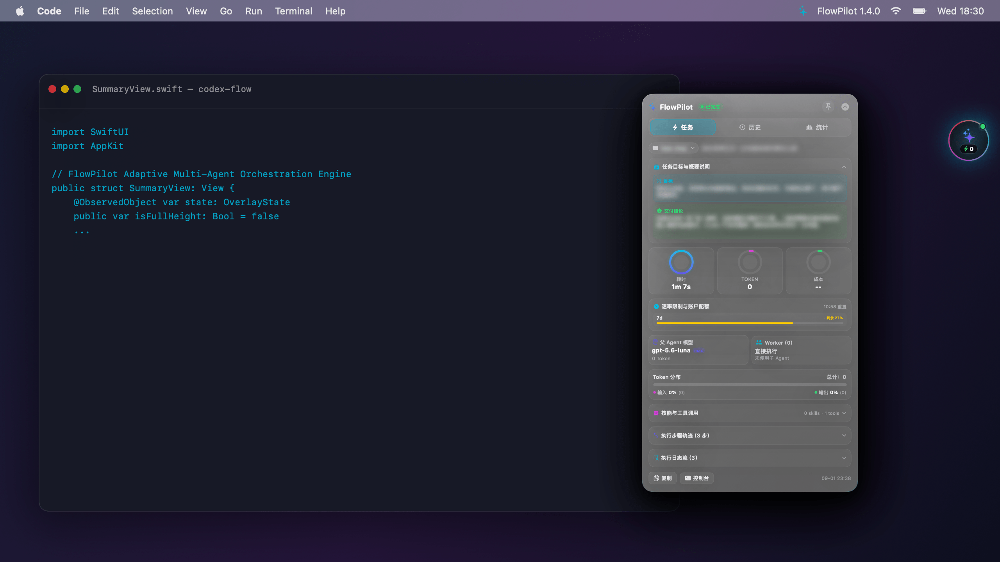

# macOS 原生悬浮窗组件 (FlowPilot Overlay)

<div align="center">


<br />

[ 简体中文 ](overlay.md) | [ English ](overlay.en.md)

</div>


**FlowPilot Overlay** 是专为 macOS 设计的 100% 纯原生桌面交互组件（基于 **SwiftUI + AppKit** 构建）。无需打开终端或网页，即可在桌面上实时获取多 Agent 协同编排 Telemetry 遥测指标、账户速率配额感知、历史会话回溯以及聚合效能分析看板。



---

## 视觉架构与三大核心视态


### 1. 🟢 灵动微胶囊 (Micro Capsule · 闲置与常态)
- **极致轻量**：直径 68px 的 Frosted Glass 毛玻璃拟物圆环（基于 macOS 原生 `ultraThinMaterial`）。
- **动态呼吸环**：彩虹流动渐变光圈与实时状态呼吸灯：
  - 🟢 **空闲/完成**：常亮绿灯，随时待命。
  - 🔵 **运行中**：青蓝呼吸流光与实时秒级计时器。
  - 🟠 **告警/异常**：橙光提示任务异常或速率配额告急。
- **Token 徽章**：底部微缩呈现最近一次任务的 Token 消耗（如 `198.2k`）。
- **边缘智能半收起**：靠拢屏幕边缘时自动 Half-Tuck，支持防溢出磁吸贴边。

---

### 2. ⚡️ Inspector (任务实时巡检与配额监控)
- **任务目标与交付结论卡**：智能提炼展示当前会话的 `目标 (Objective)` 与最终交付 `结论 (Conclusion / Outcome)`。
- **3 组高精环形仪表盘**：动态呈现 **耗时**（`1m 4s`）、**Tokens**（`198.2k`）与 **费用预估**。
- **执行轨迹与日志流**：可折叠展开 19+ 步执行轨迹细节与完整日志流。
- **账户速率限制与配额**：实时跟踪 5m / 1h / 1d / 7d 窗口配额消耗进度条（`usedPercent`）、本次任务配额差值（`+1 pp`）与配额重置倒计时。
- **多 Agent 拓扑树**：层级展示 Parent Agent 规划模型与各个 Worker Subagent 子任务。
- **Token 细分分布条**：直观堆叠展示输入、缓存命中、输出与推理思考 Token 比例。
- **技能与 MCP 标签**：自动嗅探并以紫色/橙色徽章标识当前调用的 Skills 与 MCP Server 工具。
- **历史查看态导航**：回溯任意历史任务，点击 `[⚡️ 查看最新]` 可一键瞬间切回实时追踪。

---

### 3. 📜 History (多维对话与任务流水线)
- **维度 1（项目过滤与时间范围）**：按独立仓库/工程筛选，或快速切换 `全部 (All)` / `今天 (Today)`。
- **维度 2（会话手风琴 Chat Accordion）**：按对话会话聚合多轮任务（`#1`、`#2`、`#3`），展示总 Token 汇总、持续时长与最大 Worker 并发数。
- **维度 3（执行轮次流水线 Session Turns）**：按轮次展开（`#1.1`、`#1.2`），精确呈现时间戳、耗时、Worker 标签与本轮配额变动（`+1%` / `-1%`）。
- **即时关键词搜索**：毫秒级实时筛选对话标题、Git 分支与 Prompt 指令。
- **一键穿透巡检**：点击任一历史轮次，立即在 Inspector 中穿透展开该任务的全部细节。

---

### 4. 📊 Analytics (30 天效能聚合看板)
- **周期切换**：支持一键切换 `7 天` 与 `30 天` 聚合分析视图。
- **核心效能 KPI**：汇总任务总数（委派派发 vs 直接执行）、累计活跃工时与总消耗 Token。
- **缓存效率 (Cache Hit)**：缓存命中百分比与累计节省 Token 数。
- **Worker 分流率 (Offload Ratio)**：经济型 Worker 承担的计算分流百分比。
- **模型分布矩阵**：各模型的调用次数、Token 占比与角色定位（Parent / Worker）。
- **项目活跃度排行**：多工程/多仓库的任务频次与活跃热度排行。

---

## 🔒 隐私脱敏与演示模式 (Privacy & Demo Mode)

FlowPilot 内置了系统级隐私保护模式（`isPrivacyMode`），专为公开演示、技术分享或录屏截图设计，防止敏感工程名、私有指令或业务数据泄露。

开启脱敏模式后：
- 任务 **目标** 与 **交付结论** 使用原生高斯模糊滤镜（`blur(radius: 4.5)`）平滑处理。
- 顶部 Header 与历史列表中的 **会话标题** 及 **Prompt 提示词** 自动毛玻璃脱敏。
- 项目与仓库名称在 Header、History 与 Analytics 视图中均自动打码。

---

## 🛠️ 超高精无截断截图与宣传图渲染管线

FlowPilot 提供了基于 SwiftUI `ImageRenderer` 的全景无截断渲染脚本 ([scripts/generate_showcase.swift](file:///Users/parsifal/Repo/SkillHub/codex-flow/scripts/generate_showcase.swift))，可一键输出 2x / 3x Retina 高清资产：

```bash
# 编译并生成全套高精截图与宣传物料
SWIFT_FILES=($(find apps/macos-overlay/Sources -name "*.swift" ! -name "main.swift"))
swiftc -framework Cocoa -framework SwiftUI -framework Combine "${SWIFT_FILES[@]}" scripts/generate_showcase.swift -o bin/generate_showcase
bin/generate_showcase
```

生成产物位于 `docs/assets/`：
- `docs/assets/screenshots/inspector_full.png`（全高无截断 Inspector 视图）
- `docs/assets/screenshots/history_full.png`（全高无截断 History 任务流水线）
- `docs/assets/screenshots/analytics_full.png`（全高无截断 Analytics 看板）
- `docs/assets/screenshots/capsule.png`（3x Retina 灵动微胶囊）
- `docs/assets/promo/flowpilot_promo_poster.png`（2720 × 2002 三态对比全景海报）
- `docs/assets/promo/flowpilot_promo_banner.png`（2680 × 1594 宽屏 Hero Banner）
- `docs/assets/promo/flowpilot_promo_desktop_scene.png`（2560 × 1440 沉浸式桌面场景图）

---

## 🚀 快速上手与 CLI 控制

### 编译与运行
```bash
# 源码编译
bash apps/macos-overlay/build.sh

# 启动常驻浮窗守护进程
codex-flow overlay start
```

### CLI 控制指令
```bash
# 查看浮窗运行状态
codex-flow overlay status

# 切换 展开 / 收起
codex-flow overlay toggle
codex-flow overlay expand       # 展开为卡片
codex-flow overlay collapse     # 收起为灵动微胶囊

# 切换选项卡
codex-flow overlay tab inspector
codex-flow overlay tab history
codex-flow overlay tab analytics

# 穿透查看指定历史任务
codex-flow overlay show 1

# 打开统计看板与历史
codex-flow overlay stats 30     # 30 天效能统计
codex-flow overlay history      # 任务历史列表

# 进程生命周期管理
codex-flow overlay restart
codex-flow overlay stop
```

---

## 🖱️ 鼠标与快捷交互

| 动作 | 交互效果 |
| :--- | :--- |
| **光标悬停气泡 (0.4s)** | 触发 Spring 弹性展开为全功能毛玻璃监控台 |
| **光标离开卡片 (0.8s)** | 延迟自动收起为微胶囊（未 Pin 锁定时） |
| **点击气泡 / 顶部折叠按钮** | 瞬间切换展开 / 折叠状态 |
| **点击 Pin 锁定图标 (`📌`)** | 永久置顶常驻桌面，不随光标移出收起 |
| **任意位置拖拽** | 自由平滑拖拽，支持屏幕边缘磁吸吸附 |
| **右键上下文菜单** | 快速切换视图、Pin 锁定、刷新数据、打开终端或退出应用 |
| **点击「复制摘要 (Copy Summary)」**| 格式化复制任务报告至系统剪贴板（带 Copied 动画反馈） |
| **点击「控制台 (Console)」** | 快速在终端中唤起 `codex-flow` 交互式管理菜单 |
