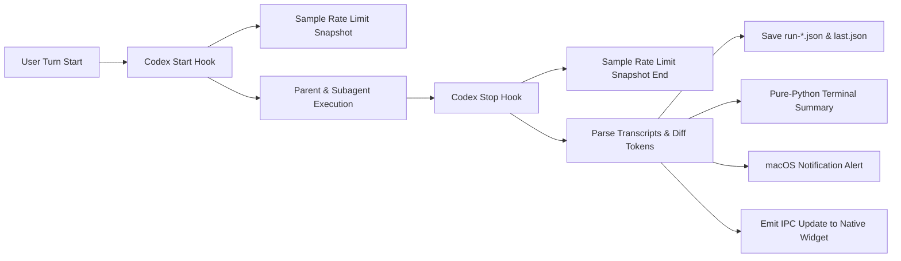

# Telemetry & Quota Attribution

<div align="center">

[ 简体中文 ](telemetry.md) | [ English ](telemetry.en.md)

</div>

`codex-flow` includes a zero-overhead, deterministic telemetry engine that tracks multi-agent turn lifecycles, token breakdowns, and account rate-limit quotas without invoking secondary LLMs.

---

## Design Principles

1. **Zero LLM Invocation**: The telemetry collector and formatter are written in pure Python. No secondary LLM calls are made to summarize runs.
2. **Turn-Based Isolation**: Each user interaction turn is tracked as a single atomic `flow run`.
3. **Deterministic Token Attribution**: Turn-level delta arithmetic is computed from native Codex `token_count` transcript events.
4. **App-Server Rate Limits**: Live quota snapshots (`usedPercent`, remaining, and `+X pp` delta) are collected from the local `codex app-server`.
5. **Fail-Open Resilience**: If any hook, app-server endpoint, or transcript field is missing, execution continues unimpeded with graceful fallbacks.

---

## Telemetry Architecture



---

## Collected Metrics

| Category | Metric | Source | Description |
| :--- | :--- | :--- | :--- |
| **Participants** | Parent / Worker count, models & outcomes | Transcript / Hooks | Models, reasoning levels, and worker completion messages |
| **Token Breakdown** | Input / Cached / Output / Reasoning | Transcript diffs | Attributed token consumption per turn |
| **Quota Snapshot** | 5m, 1h, 1d window usage (`usedPercent`) | `codex app-server` | Live account quota usage percentage and delta |
| **Cost & Credits** | Estimated credits / API-equivalent | Billing routes | Derived only when official billing routes are available |
| **Session Metadata** | Project name, Git branch, Thread ID | Local index / Hooks | Project context without recording full prompts |

---

## Output Formats

### Terminal Summary Card
At the conclusion of a task, FlowPilot outputs a structured summary:

```text
FlowPilot summary
  participants  1 parent + 3 workers
  parent        gpt-5.6-sol (high)   82.4k tokens
  worker        worker-explorer     gpt-5.6-luna (high)  116.8k tokens  completed
  worker        worker-implementer  gpt-5.6-luna (xhigh) 401.2k tokens  completed
  worker        worker-implementer  gpt-5.6-luna (high)   68.4k tokens  completed
  attributed    668.8k tokens  1.840 credits
  account quota (used) 5h 31%→34% (+3 pp; 66% remaining); 7d 18%→19% (+1 pp; 81% remaining)
```

### macOS Notification
A lightweight notification is dispatched to macOS Notification Center:
```text
FlowPilot • my-project
Completed with 3 workers (668.8k tokens, 42s)
```

---

## Telemetry CLI Commands

### 1. View Last Task
```bash
# Formatted terminal card
codex-flow usage last

# Raw JSON data
codex-flow usage last --json
```

### 2. History Listing
```bash
# List recent 10 runs
codex-flow usage list -n 10

# Filter by project or today only
codex-flow usage list -p my-project --today
```

### 3. Detailed Run Inspection
```bash
# View details of a specific historical run (#1, #2 or session ID)
codex-flow usage show 1
```

### 4. Aggregate Analytics
```bash
# 30-day cross-project efficiency & offload analysis
codex-flow usage stats -d 30

# Filter by project
codex-flow usage stats -p my-project -d 7
```

### 5. Historical Telemetry Repair & Backfill
Scan and backfill recoverable fields (skills, tools, trajectories, command logs, task summaries, and metadata enrichment) for historical runs in `~/.codex/codex-flow/telemetry/runs/*.json`:

```bash
# Preview changes (scan & report without modifying files)
codex-flow telemetry repair --dry-run

# Perform backfill repair (idempotent, atomic JSON writes)
codex-flow telemetry repair
```

**Backfill Principles**:
- **Preserve Existing Data**: Only fills in missing fields; never overwrites valid existing data.
- **No Guesswork**: Quota deltas are only calculated when both `quota_before` and `quota_after` snapshots exist. Missing quota snapshots are marked as impossible rather than estimated.
- **Idempotent**: Repeated execution safely reports `repaired: 0`.
- **Authoritative Sync**: Safely updates `last.json` if the repaired run matches the latest session and turn ID.

---

## Log Storage & Retention

- **Directory**: `~/.codex/codex-flow/telemetry/runs/`
- **Latest Pointer**: `~/.codex/codex-flow/telemetry/last.json`
- **Default Retention**: 30 days (`retention_days = 30`).
- **Orphan Auto-Merging**: Unattached worker transcripts are linked by `agent_id` or parent/worker timestamp windows and merged on the next parent stop event.
