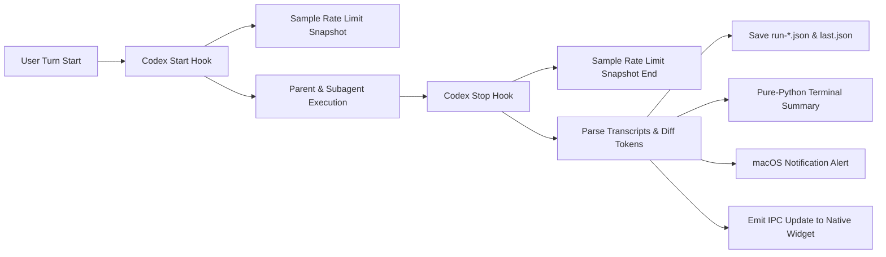

# Telemetry & Quota Attribution

<div align="center">

[ 简体中文 ](telemetry.md) | [ English ](telemetry.en.md)

</div>

`codex-flow` includes a zero-overhead, deterministic telemetry engine that tracks multi-agent turn lifecycles, token breakdowns, and account rate-limit quotas without invoking secondary LLMs.

---

## Store goals, plans, and results per turn

A project uses `cwd`, a chat uses `session_id`, and a turn uses `turn_id`.
Goals belong to `session_id + turn_id`. New turns never replace earlier goals
or rewrite the user's messages.

With an explicit receipt delivered by the host to this parent turn, use UTF-8 files:

```bash
codex-flow telemetry context write-goal --receipt-file receipt.json --text-file goal.txt
codex-flow telemetry context write-plan --receipt-file receipt.json --plan-file plan.json --origin compiled
```

Goals accept 1–80 Unicode code points and at most two sentences and become immutable after the first write.
Repeated identical writes are idempotent. Plans retain the complete schema-11
planner JSON. Use `--origin reused` when continuing the same task's existing plan;
do not reset its budget. Public run snapshots never contain the receipt secret.

Only parent Stop publishes `turn_context`, the exact parent-turn `result`, and
`publication`. Its revision identifies a complete snapshot; its completion time
is fixed on first publication. Replayed Stops do not notify twice, and late
workers cannot move `last.json` back to an older turn. After a crash between the
run and last writes, use `codex-flow telemetry recover-last --quiet`. Recovery
does not send a completion notification. Disabled telemetry performs no state,
lock, or IPC writes; historical reads remain available.

**Compatibility is verified per installation.** The development installation has
passed real Desktop receipt delivery, same-turn goal/full-plan writes, and parent
Stop publication, and has explicitly enabled automatic delivery locally. New
installations remain off until verified; other hosts need their own validation.
Missing receipt/final evidence displays “Not recorded” rather than guessing from
the latest turn, user prompt, or last assistant message. Python/CLI retain
Windows-compatible code; native Windows locking still needs CI or device validation.

The repository includes a one-turn Desktop probe in `tests/turn-context-desktop-probe.py`.
Explicitly select a chat and working directory with `arm --session-id <id> --cwd <absolute-path>`.
The default wait expires after 30 minutes. Add `--wait-for-next-turn` for manual
validation across sessions; it still accepts only one parent turn in the selected chat and directory.
The next real parent turn can receive its receipt path through
`UserPromptSubmit.hookSpecificOutput.additionalContext`. A real user message must
trigger the hook. `status` succeeds only after same-turn goal, full plan, and
parent Stop publication match. Synthetic hooks and unit tests do not establish
Desktop support, and the probe never enables global automatic writes.

After `status` reports `supported_probe`, enable automatic delivery for this
installation explicitly. An unverified probe returns `host_transport_unverified`
without creating transport configuration:

```bash
codex-flow telemetry context enable-desktop-transport
```

`bash tests/turn-context-host.sh` checks the installation’s actual Desktop probe
status. It never launches an extra model task or treats a CLI marker as Desktop evidence.

Overlay startup uses `recover-last --quiet` to avoid IPC alerts while restoring history.

## Keep collection independent of the main task

1. **Zero LLM Invocation**: The telemetry collector and formatter are written in pure Python. No secondary LLM calls are made to summarize runs.
2. **Turn-Based Isolation**: Each user interaction turn is tracked as a single atomic `flow run`.
3. **Deterministic Token Attribution**: Turn-level delta arithmetic is computed from native Codex `token_count` transcript events.
4. **App-Server Rate Limits**: Live quota snapshots (`usedPercent`, remaining, and `+X pp` delta) are collected from the local `codex app-server`.
5. **Fail-Open Resilience**: If any hook, app-server endpoint, or transcript field is missing, execution continues unimpeded with graceful fallbacks.

---

## Telemetry Architecture



---

## Collected Metrics

| Category | Metric | Source | Description |
| :--- | :--- | :--- | :--- |
| **Participants** | Parent / Worker count, models & outcomes | Transcript / Hooks | Models, reasoning levels, and worker completion messages |
| **Token Breakdown** | Input / Cached / Output / Reasoning | Transcript diffs | Attributed token consumption per turn |
| **Quota Snapshot** | 5m, 1h, 1d window usage (`usedPercent`) | `codex app-server` | Live account quota usage percentage and delta |
| **Cost & Credits** | Estimated credits / API-equivalent | Billing routes | Derived only when official billing routes are available |
| **Session Metadata** | Project name, Git branch, Thread ID | Local index / Hooks | Project context without recording full prompts |

---

## Output Formats

A worker can be reused across turns. The collector records attribution and usage by worker ID and child execution turn ID. Executions in different parent turns remain separate; multiple executions within one parent turn count as one worker with their token usage combined. Duplicate stop events do not add usage again, and delayed events retain their original attribution. When attribution evidence is missing, a separate record preserves the event without overwriting another turn. A reused worker's cumulative thread usage cannot substitute for one execution's usage.

### Terminal Summary Card
At the conclusion of a task, FlowPilot outputs a structured summary:

```text
FlowPilot summary
  participants  1 parent + 3 workers
  parent        gpt-5.6-sol (high)   82.4k tokens
  worker        worker-explorer     gpt-5.6-luna (high)  116.8k tokens  completed
  worker        worker-implementer  gpt-5.6-luna (xhigh) 401.2k tokens  completed
  worker        worker-implementer  gpt-5.6-luna (high)   68.4k tokens  completed
  attributed    668.8k tokens  1.840 credits
  account quota (used) 5h 31%→34% (+3 pp; 66% remaining); 7d 18%→19% (+1 pp; 81% remaining)
```

### macOS Notification
A lightweight notification is dispatched to macOS Notification Center:
```text
FlowPilot • my-project
Completed with 3 workers (668.8k tokens, 42s)
```

---

## Telemetry CLI Commands

### 1. View Last Task
```bash
# Formatted terminal card
codex-flow usage last

# Raw JSON data
codex-flow usage last --json
```

### 2. History Listing
```bash
# List recent 10 runs
codex-flow usage list -n 10

# Filter by project or today only
codex-flow usage list -p my-project --today
```

### 3. Detailed Run Inspection
```bash
# View details of a specific historical run (#1, #2 or session ID)
codex-flow usage show 1
```

### 4. Aggregate Analytics
```bash
# 30-day cross-project efficiency & offload analysis
codex-flow usage stats -d 30

# Filter by project
codex-flow usage stats -p my-project -d 7
```

### 5. Historical Telemetry Repair & Backfill
Scan and backfill recoverable fields (skills, tools, trajectories, command logs, task summaries, and metadata enrichment) for historical runs in `~/.codex/codex-flow/telemetry/runs/*.json`:

```bash
# Preview changes (scan & report without modifying files)
codex-flow telemetry repair --dry-run

# Perform backfill repair (idempotent, atomic JSON writes)
codex-flow telemetry repair
```

**Backfill Principles**:
- **Preserve Existing Data**: Only fills in missing fields; never overwrites valid existing data.
- **No Guesswork**: Quota deltas are only calculated when both `quota_before` and `quota_after` snapshots exist. Missing quota snapshots are marked as impossible rather than estimated.
- **Idempotent**: Repeated execution safely reports `repaired: 0`.
- **Authoritative Sync**: Safely updates `last.json` if the repaired run matches the latest session and turn ID.

### 6. Worker Latency and Reasoning-Rollout Reports

FlowPilot keeps a separate, purpose-limited append-only ledger at `~/.codex/codex-flow/telemetry/latency.jsonl`. It is used only to compare Worker latency, success, and reasoning rollout; it does not reuse the richer run-summary JSON. Records allow only strategy/stage/role/model tokens, legacy/proposed/selected/observed effort, terminal status, Unix-second timing, and repair/checkpoint counters. Task, Worker, and work-unit identifiers are hashed with a random local salt. A strict field allowlist rejects prompts, transcripts, conclusions, tool arguments, output, cwd, and absolute paths.

FlowPilot records observations when it receives a checkpoint and a Worker terminal result. It sets `observed_effort` only when the runtime confirms the effort actually used for that spawn; planner `selected_effort` must never be relabeled as observed. Collection is fail-open and must not block the task.

```bash
# Pass event JSON with --event-json or stdin.
codex-flow telemetry latency record --event-json '{...}'

# Human summary or deterministic JSON.
codex-flow telemetry latency report
codex-flow telemetry latency report --json
```

Only timed `completed`/`failed` terminal observations enter the nearest-rank p50/p95 calculation. `cancelled`/`timeout` observations are reported as censored; missing durations and checkpoint observations are separate, so truncation cannot manufacture a lower latency. `eligible_for_tuning` becomes true only after a homogeneous group has at least 20 uncensored terminal observations and a confirmed `observed_effort`. The report is advisory and never mutates policy; inspect success and censoring rates before enabling `adaptive`.

---

## Log Storage & Retention

- **Directory**: `~/.codex/codex-flow/telemetry/runs/`
- **Latest Pointer**: `~/.codex/codex-flow/telemetry/last.json`
- **Redacted Latency Ledger**: `~/.codex/codex-flow/telemetry/latency.jsonl`
- **Default Retention**: 30 days (`retention_days = 30`).
- **Orphan Auto-Merging**: Unattached worker transcripts are linked by `agent_id` or parent/worker timestamp windows and merged on the next parent stop event.
