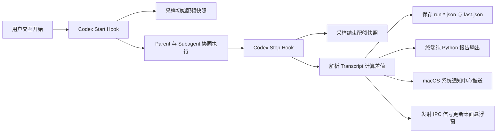

# Telemetry 遥测归因与配额感知

<div align="center">

[ 简体中文 ](telemetry.md) | [ English ](telemetry.en.md)

</div>

`codex-flow` 内置了零开销、确定性的 Telemetry 遥测引擎，能够在不额外调用任何二次 LLM 的前提下，精确捕获多 Agent 轮次生命周期、细分 Token 归因差值与账户速率配额变动。

---

## 核心设计原则

1. **零 LLM 额外开销**：遥测采集器与格式化器全部由纯 Python 编写，绝不产生二次 LLM Token 浪费。
2. **轮次级原子隔离**：用户每一次交互轮次均作为单一原子的 `flow run` 独立追踪。
3. **确定性 Token 差值归因**：直接从 Codex 原生 transcript 的 `token_count` 事件计算轮次差值，精准归因。
4. **App-Server 实时配额采样**：通过本地 `codex app-server` 端点实时捕获账户配额水位（`usedPercent`、剩余量及本次变动 `+X pp`）。
5. **Fail-Open 容错设计**：即使 Hook 异常、端点无法访问或字段缺失，整体执行流程绝对不被阻塞。

---

## 遥测采集架构



---

## 采集指标维度

| 指标分类 | 核心字段 | 数据源 | 详细描述 |
| **参与角色** | Parent / Worker 数量、模型与交付结论 | Transcript / Hook | 记录参与调度的模型、实际推理强度及 Worker 任务交付信息 |
| **Token 细分** | Input / Cached / Output / Reasoning | Transcript 差值计算 | 精确归因各阶段的输入、缓存命中、输出与思考 Token |
| **配额水位** | 5m, 1h, 1d 窗口使用率 (`usedPercent`) | `codex app-server` | 账户实时速率限制百分比及本轮消耗差值 |
| **费用预估** | Estimated credits / API-equivalent | 计费规则推导 | 官方计费路由可用时自动折算为额度与费用 |
| **会话上下文** | 工程名称、Git 分支、Thread ID | 本地索引 / Hook | 仅记录工程元数据，绝不上传私有完整 Prompt |

---

## 输出呈现格式

### 1. 终端摘要卡片 (Terminal Summary Card)
任务执行结束时，FlowPilot 会在终端输出结构化卡片：

```text
FlowPilot summary
  participants  1 parent + 3 workers
  parent        gpt-5.6-sol (high)   82.4k tokens
  worker        worker-explorer     gpt-5.6-luna (high)  116.8k tokens  completed
  worker        worker-implementer  gpt-5.6-luna (xhigh) 401.2k tokens  completed
  worker        worker-implementer  gpt-5.6-luna (high)   68.4k tokens  completed
  attributed    668.8k tokens  1.840 credits
  account quota (used) 5h 31%→34% (+3 pp; 66% remaining); 7d 18%→19% (+1 pp; 81% remaining)
```

### 2. macOS 原生系统通知
任务完成时自动向 macOS 通知中心发送轻量提示：
```text
FlowPilot • my-project
已完成（派发 3 个 Worker，消耗 668.8k tokens，耗时 42s）
```

---

## 遥测 CLI 命令

### 1. 查看最近一次任务
```bash
# 格式化终端卡片
codex-flow usage last

# 原始 JSON 数据输出
codex-flow usage last --json
```

### 2. 历史任务列表
```bash
# 查看最近 10 次任务
codex-flow usage list -n 10

# 按工程过滤或仅查看今日
codex-flow usage list -p my-project --today
```

### 3. 指定任务穿透详情
```bash
# 查看指定历史任务详情（支持 #1、#2 或 session_id）
codex-flow usage show 1
```

### 4. 聚合效能看板
```bash
# 跨工程 30 天效能与 Worker 分流分析
codex-flow usage stats -d 30

# 指定工程 7 天分析
codex-flow usage stats -p my-project -d 7
```

### 5. 历史遥测数据回填与修复
针对已有的历史运行记录（`~/.codex/codex-flow/telemetry/runs/*.json`），批量补齐可恢复字段（Skills、Tools、执行轨迹、命令日志、任务总结及元数据富化）：

```bash
# 演练预览（仅扫描与统计，不修改任何文件）
codex-flow telemetry repair --dry-run

# 执行正式回填修复（幂等执行，仅补缺失字段，原子写入）
codex-flow telemetry repair
```

**可恢复性判定原则**：
- **不覆盖**：仅回填缺失字段，绝不覆盖已有有效数据。
- **不猜测**：Quota Delta 仅在 `quota_before` 与 `quota_after` 均已保存时计算回填；若缺少任意一侧则视为信息已丢失，不估算、不倒推。
- **幂等性**：重复执行时显示 `repaired: 0`。
- **状态同步**：若修复的 run 对应当前的最新任务，同步原子更新 `last.json`。

---

## 日志存储与生命周期

- **存储目录**：`~/.codex/codex-flow/telemetry/runs/`
- **最新任务指针**：`~/.codex/codex-flow/telemetry/last.json`
- **默认保留期**：30 天（可由 `retention_days = 30` 配置）。
- **孤儿 Worker 自动归集**：无挂载的 Worker 会根据 `agent_id` 或时间窗口在下次 Parent Stop 事件时自动合并入父级 Session。
